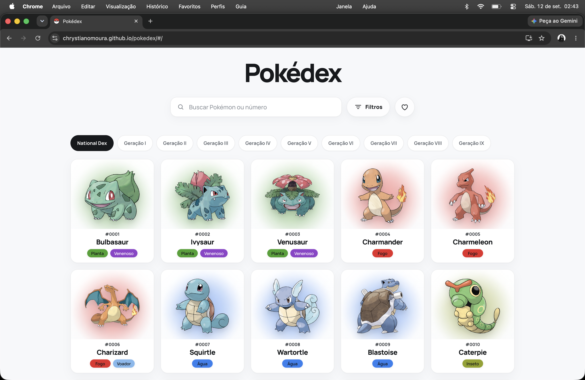
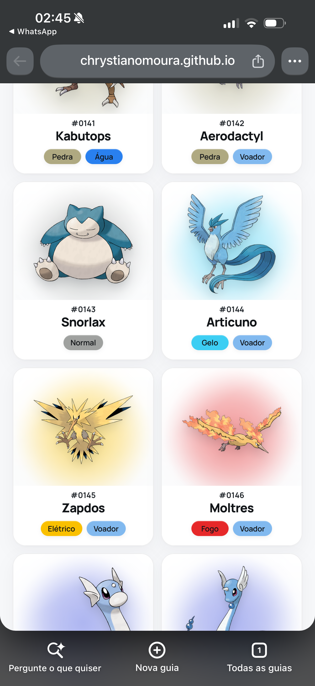
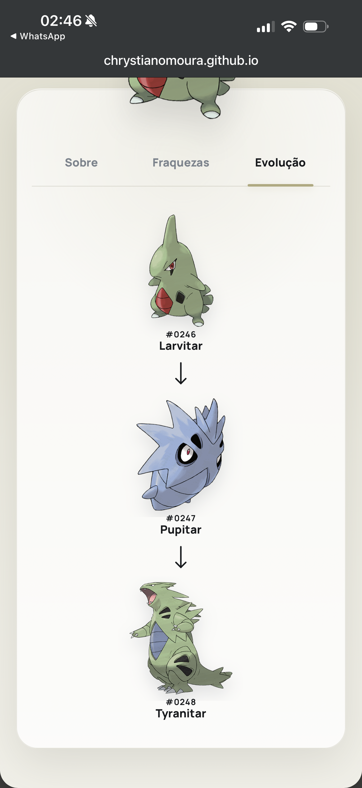

# Pokédex

> **Uma Pokédex responsiva construída como SPA em JavaScript Vanilla, com National Dex, busca, filtros, favoritos persistentes, detalhes completos, fraquezas e cadeias de evolução.**

<p align="center">
  <a href="https://chrystianomoura.github.io/pokedex/#/">
    <strong>EXPLORAR POKÉDEX</strong>
  </a>
</p>

<p align="center">
  
  
  
  
  
  
  
</p>

<p align="center">
  
</p>

---

## Sobre o projeto

A **Pokédex** é uma aplicação front-end desenvolvida com tecnologias nativas da plataforma Web e dados da **PokéAPI**.

O projeto vai além da renderização de uma lista: diferentes recursos da API são consultados, transformados e combinados por uma arquitetura modular antes de chegarem à interface. A aplicação possui carregamento incremental, pesquisa, filtros, navegação por gerações, favoritos persistentes, roteamento client-side e páginas individuais de Pokémon.

Cada página de detalhes reúne informações de múltiplas fontes para apresentar descrição em português, tipos, altura, peso, fraquezas, artwork Normal/Shiny e cadeia evolutiva.

Todo o fluxo de interface, estado e navegação foi implementado em **JavaScript Vanilla com ES Modules**, sem framework ou biblioteca JavaScript de UI.

### Destaques

- National Dex com carregamento incremental.
- Pesquisa por nome ou número.
- Filtros e navegação pelas nove gerações.
- Favoritos persistidos no navegador.
- SPA com roteador próprio e rotas compartilháveis.
- Página individual para cada Pokémon.
- Descrições em português.
- Artwork Normal e Shiny.
- Fraquezas calculadas a partir das relações entre tipos.
- Cadeias evolutivas navegáveis.
- Tratamento distinto para 404, falha de rede e erros inesperados.
- Estado da Home preservado durante a navegação.
- Interface responsiva para mobile, tablet e desktop.
- Estrutura PWA com manifest e Service Worker.
- Arquitetura dividida em API, services, features e components.

---

## Experiência

### National Dex

A tela principal apresenta a National Dex em uma grade responsiva. O carregamento é incremental: novos grupos são adicionados conforme necessário, evitando que toda a Pokédex precise ser processada e inserida no DOM durante a primeira renderização.

A interface combina pesquisa, filtros, favoritos e navegação horizontal por gerações sem separar a experiência em páginas tradicionais.

<p align="center">
  
</p>

### Busca, filtros e gerações

A pesquisa permite localizar Pokémon por **nome ou número**.

Filtros e gerações utilizam fluxos próprios, coordenados pelas respectivas features. A Home controla qual fonte de resultados está ativa para evitar que National Dex, busca, filtros e gerações disputem simultaneamente a mesma grade.

A navegação contempla:

```text
National Dex
Geração I
Geração II
Geração III
Geração IV
Geração V
Geração VI
Geração VII
Geração VIII
Geração IX
```

A mudança de conjunto acontece sem recarregar o documento HTML.

### Favoritos

Qualquer Pokémon pode ser adicionado ou removido dos favoritos diretamente pela interface.

A seleção é persistida no navegador e possui uma rota dedicada:

```text
#/favorites
```

A listagem de favoritos reutiliza os mesmos componentes empregados na Pokédex principal, mantendo comportamento e apresentação consistentes.

---

## Detalhes do Pokémon

Cada Pokémon possui uma rota própria:

```text
#/pokemon/pikachu
#/pokemon/charizard
#/pokemon/lucario
```

A página combina dados processados por diferentes services e apresenta:

- número da Pokédex;
- nome;
- tipos;
- artwork;
- versão Normal e Shiny;
- descrição;
- altura;
- peso;
- fraquezas;
- cadeia evolutiva.

O tipo principal também participa da identidade visual da página através de propriedades CSS dinâmicas.

### Normal e Shiny

O artwork pode ser alternado entre **Normal** e **Shiny** sem nova navegação ou recarregamento.

O estado visual é atualizado no próprio componente, preservando as demais informações da página.

### Fraquezas

As fraquezas possuem lógica dedicada em:

```text
js/services/pokemon-weaknesses.js
```

As relações de dano dos tipos são processadas antes de chegar à interface, permitindo que Pokémon de tipo único ou duplo utilizem o mesmo fluxo de apresentação.

### Evoluções

A cadeia evolutiva não é inserida diretamente a partir da resposta bruta da API.

A aplicação consulta a cadeia, identifica as espécies envolvidas, obtém os dados necessários de cada estágio e transforma a estrutura em uma árvore própria para renderização.

Os Pokémon exibidos na árvore são navegáveis e levam diretamente às respectivas páginas de detalhes.

<p align="center">
  
</p>

---

## Arquitetura

A aplicação é organizada em camadas com responsabilidades distintas:

```text
                  ┌──────────────┐
                  │   PokéAPI    │
                  └──────┬───────┘
                         │
                         ▼
                  ┌──────────────┐
                  │     API      │
                  └──────┬───────┘
                         │
                         ▼
                  ┌──────────────┐
                  │   Services   │
                  └──────┬───────┘
                         │
                         ▼
                  ┌──────────────┐
                  │   Features   │
                  └──────┬───────┘
                         │
                         ▼
                  ┌──────────────┐
                  │  Components  │
                  └──────┬───────┘
                         │
                         ▼
                  ┌──────────────┐
                  │ App / Router │
                  └──────────────┘
```

A divisão evita que componentes de interface precisem conhecer endpoints, composição de requisições ou regras específicas do domínio.

### API

```text
js/api/
├── pokeapi.js
└── pokemon-descriptions.js
```

A camada de API centraliza a comunicação com fontes externas.

`pokeapi.js` também diferencia erros HTTP de falhas de conectividade, permitindo que as camadas superiores decidam como cada situação deve ser apresentada.

### Services

```text
js/services/
├── favorites.js
├── pokemon-detail.js
├── pokemon-evolution.js
├── pokemon-generation.js
├── pokemon-search.js
├── pokemon-weaknesses.js
└── pokemon.js
```

Services concentram transformação, composição e regras relacionadas aos dados.

Um componente não precisa saber quais endpoints são necessários para construir uma evolução ou determinar fraquezas. Ele recebe uma estrutura já preparada para apresentação.

### Features

```text
js/features/
├── favorites.js
├── filters.js
├── generations.js
├── national-dex.js
├── pokemon-detail.js
└── search.js
```

Features coordenam comportamento, estado e operações assíncronas.

O fluxo geral segue:

```text
interação
    │
    ▼
 feature
    │
    ▼
 service
    │
    ▼
   API
    │
    ▼
dados processados
    │
    ▼
 component
```

Essa camada também coordena os diferentes modos de visualização da aplicação.

### Components

```text
js/components/
├── favorites-link.js
├── pokemon-card.js
├── pokemon-detail.js
├── pokemon-filters.js
├── pokemon-generation.js
└── pokemon-search.js
```

Components constroem e atualizam a interface.

Os componentes recebem dados e callbacks em vez de concentrar acesso à API e regras de negócio, permitindo reutilização em diferentes contextos.

### Data e Utils

Metadados estáticos dos tipos são centralizados em:

```text
js/data/pokemon-types.js
```

Funções auxiliares reutilizáveis ficam em:

```text
js/utils/pokemon-name.js
```

---

## Fluxo de dados

Uma página de detalhes exemplifica a composição realizada pela aplicação:

```text
rota /pokemon/:pokemon
        │
        ▼
pokemon-detail feature
        │
        ▼
Pokémon / forma
        │
        ├───────────────┐
        ▼               ▼
     espécie          tipos
        │               │
        ▼               ▼
   descrição        relações
        │            de dano
        │
        └──────┬────────┘
               │
               ├────────────► fraquezas
               │
               ▼
       cadeia evolutiva
               │
               ▼
        dados processados
               │
               ▼
          componente
```

As requisições assíncronas são coordenadas antes da montagem final da página.

Quando uma navegação torna uma requisição anterior irrelevante, o fluxo de detalhes utiliza `AbortController` para impedir que resultados obsoletos atualizem a interface.

---

## SPA e roteamento

A Pokédex funciona como uma **Single Page Application**.

O roteador foi implementado especificamente para o projeto:

```text
js/router/router.js
```

As rotas utilizam hash routing:

```text
#/
#/favorites
#/pokemon/pikachu
```

O roteador:

- interpreta a URL;
- reconhece rotas;
- extrai parâmetros;
- atualiza o histórico;
- intercepta links internos;
- reage à navegação do navegador;
- aciona a montagem da view correspondente.

No GitHub Pages, uma rota pode ser aberta diretamente:

```text
https://chrystianomoura.github.io/pokedex/#/pokemon/pikachu
```

O hash routing mantém as rotas compatíveis com hospedagem estática sem exigir regras de rewrite no servidor.

### Estado de navegação

A Home mantém estado próprio durante a navegação.

Ao abrir um Pokémon e retornar, a aplicação pode restaurar informações relevantes da experiência anterior, incluindo a posição vertical da página e a posição horizontal da navegação de gerações.

Isso permite entrar em detalhes sem transformar o retorno à Pokédex em uma nova sessão de navegação.

---

## Integração com a PokéAPI

A **PokéAPI** é a principal fonte de dados da aplicação.

Entre os recursos processados estão:

- Pokémon e formas;
- espécies;
- tipos;
- artworks;
- altura e peso;
- gerações;
- relações de dano;
- cadeias evolutivas.

As respostas externas não são utilizadas diretamente como modelo da interface.

```text
resposta externa
      │
      ▼
     API
      │
      ▼
   service
      │
      ▼
normalização / composição
      │
      ▼
   feature
      │
      ▼
 component
```

Essa fronteira reduz o acoplamento entre o formato da API e o DOM.

### Tratamento de erros

Falhas de requisição são classificadas para que situações diferentes não produzam a mesma resposta visual.

```text
404
 │
 ▼
Pokémon não encontrado

falha de rede
 │
 ▼
problema de conexão + nova tentativa

erro inesperado
 │
 ▼
estado genérico de erro + nova tentativa
```

A página de detalhes também possui skeleton próprio durante o carregamento.

---

## CSS e responsividade

O CSS é modularizado por componente:

```text
css/
├── base.css
└── components/
    ├── favorites-link.css
    ├── favorites.css
    ├── pokemon-card.css
    ├── pokemon-filters.css
    ├── pokemon-generation.css
    ├── pokemon-search.css
    └── pokemon-detail/
        ├── content.css
        ├── detail.css
        ├── evolution.css
        ├── facts.css
        ├── hero.css
        ├── states.css
        └── weaknesses.css
```

A página de detalhes possui uma subdivisão própria para evitar concentrar hero, conteúdo, fatos, fraquezas, evolução e estados em uma única folha de estilos.

A responsividade utiliza recursos nativos do CSS, incluindo Grid, Flexbox, Custom Properties, `clamp()` e media queries.

---

## Tipos

Os **18 tipos** possuem identidade visual própria:

```text
Normal      Fogo        Água
Elétrico    Planta      Gelo
Lutador     Venenoso    Terrestre
Voador      Psíquico    Inseto
Pedra       Fantasma    Dragão
Sombrio     Aço         Fada
```

Os ícones ficam em:

```text
assets/type-icons/
```

Cores, nomes e demais metadados são centralizados em `pokemon-types.js`, permitindo que cards, filtros e detalhes compartilhem a mesma fonte de configuração.

---

## PWA

A aplicação inclui:

```text
manifest.webmanifest
sw.js
```

além de favicons, Apple Touch Icon e ícones próprios para instalação.

O manifest define a identidade da aplicação, enquanto o Service Worker mantém cache dos recursos pertencentes ao projeto.

A estratégia é deliberadamente limitada: dados externos da PokéAPI e outros recursos remotos não são tratados como assets estáticos permanentes.

Assim, a aplicação possui suporte offline **parcial** para sua estrutura local, mas continua dependendo de conectividade para dados da PokéAPI que não estejam disponíveis localmente.

---

## Acessibilidade

A interface utiliza controles HTML nativos e semântica apropriada sempre que possível.

Entre as decisões implementadas estão:

- botões nativos para ações;
- links para navegação;
- nomes acessíveis em controles iconográficos;
- `aria-pressed` para estados binários;
- `aria-live` para feedback dinâmico;
- tabs com `role="tab"`, `tabpanel` e `aria-selected`;
- estados `hidden`;
- navegação por teclado nas tabs;
- textos alternativos;
- elementos decorativos ocultados de tecnologias assistivas quando apropriado;
- áreas de interação adequadas para touch.

O projeto busca boa acessibilidade prática, mas não representa uma auditoria formal de conformidade WCAG.

---

## Tecnologias

| Tecnologia / API       | Responsabilidade                           |
| ---------------------- | ------------------------------------------ |
| **HTML5**              | estrutura semântica e metadados            |
| **CSS3**               | layout, responsividade e identidade visual |
| **JavaScript Vanilla** | lógica, estado e interface                 |
| **ES Modules**         | modularização                              |
| **Fetch API**          | comunicação HTTP                           |
| **AbortController**    | cancelamento de operações obsoletas        |
| **History API**        | histórico da SPA                           |
| **localStorage**       | persistência de favoritos                  |
| **Service Worker API** | cache da aplicação                         |
| **Web App Manifest**   | identidade e instalação                    |
| **PokéAPI**            | dados dos Pokémon                          |
| **GitHub Pages**       | deploy                                     |

Não há framework JavaScript, biblioteca de UI, bundler ou dependência de runtime.

---

## Estrutura

```text
pokedex/
├── assets/
│   ├── screenshots/
│   │   ├── evolution-mobile.png
│   │   ├── home-desktop.png
│   │   └── national-dex-mobile.png
│   └── type-icons/
│       ├── bug.png
│       ├── dark.png
│       ├── dragon.png
│       ├── electric.png
│       ├── fairy.png
│       ├── fighting.png
│       ├── fire.png
│       ├── flying.png
│       ├── ghost.png
│       ├── grass.png
│       ├── ground.png
│       ├── ice.png
│       ├── normal.png
│       ├── poison.png
│       ├── psychic.png
│       ├── rock.png
│       ├── steel.png
│       └── water.png
├── css/
│   ├── base.css
│   └── components/
│       ├── pokemon-detail/
│       │   ├── content.css
│       │   ├── detail.css
│       │   ├── evolution.css
│       │   ├── facts.css
│       │   ├── hero.css
│       │   ├── states.css
│       │   └── weaknesses.css
│       ├── favorites-link.css
│       ├── favorites.css
│       ├── pokemon-card.css
│       ├── pokemon-filters.css
│       ├── pokemon-generation.css
│       └── pokemon-search.css
├── js/
│   ├── api/
│   │   ├── pokeapi.js
│   │   └── pokemon-descriptions.js
│   ├── components/
│   │   ├── favorites-link.js
│   │   ├── pokemon-card.js
│   │   ├── pokemon-detail.js
│   │   ├── pokemon-filters.js
│   │   ├── pokemon-generation.js
│   │   └── pokemon-search.js
│   ├── data/
│   │   └── pokemon-types.js
│   ├── features/
│   │   ├── favorites.js
│   │   ├── filters.js
│   │   ├── generations.js
│   │   ├── national-dex.js
│   │   ├── pokemon-detail.js
│   │   └── search.js
│   ├── router/
│   │   └── router.js
│   ├── services/
│   │   ├── favorites.js
│   │   ├── pokemon-detail.js
│   │   ├── pokemon-evolution.js
│   │   ├── pokemon-generation.js
│   │   ├── pokemon-search.js
│   │   ├── pokemon-weaknesses.js
│   │   └── pokemon.js
│   ├── utils/
│   │   └── pokemon-name.js
│   └── app.js
├── apple-touch-icon.png
├── favicon-16x16.png
├── favicon-32x32.png
├── favicon-48x48.png
├── favicon-192x192.png
├── favicon-512x512.png
├── favicon.ico
├── index.html
├── manifest.webmanifest
├── sw.js
└── README.md
```

---

## Como executar

Não há processo de build ou instalação de dependências.

```bash
git clone https://github.com/chrystianomoura/pokedex.git
cd pokedex
python3 -m http.server 5500
```

Depois acesse:

```text
http://localhost:5500/#/
```

Também é possível utilizar um servidor HTTP local equivalente, como o Live Server do VS Code.

Como a aplicação utiliza ES Modules, Service Worker e requisições HTTP, executar o projeto através de um servidor local evita as limitações do protocolo `file://`.

**Versão publicada:**  
https://chrystianomoura.github.io/pokedex/#/

---

## Decisões técnicas

| Problema                                                  | Decisão                                           |
| --------------------------------------------------------- | ------------------------------------------------- |
| Projeto deveria permanecer independente de frameworks     | JavaScript Vanilla + ES Modules                   |
| API externa não deveria ficar acoplada aos componentes    | Separação em API, services, features e components |
| National Dex completa teria custo inicial desnecessário   | Carregamento incremental                          |
| Diferentes consultas compartilham a mesma Home            | Coordenação de estado pelas features              |
| Navegação precisava funcionar sem reload                  | Router client-side próprio                        |
| GitHub Pages não oferece rewrite de SPA                   | Hash routing                                      |
| Retornar de um detalhe não deveria reiniciar a Home       | Preservação do estado de navegação                |
| Favoritos deveriam sobreviver a novas sessões             | Persistência local                                |
| Pokémon de dois tipos exigem composição de fraquezas      | Service dedicado às relações de dano              |
| Evoluções possuem estrutura hierárquica                   | Normalização para árvore própria                  |
| Requisições antigas poderiam concluir após nova navegação | `AbortController` + controle de request           |
| Erros de rede não deveriam parecer 404                    | Classes e estados de erro distintos               |
| CSS de detalhes cresceu em responsabilidades              | Divisão por subcomponentes                        |
| Aplicação deveria possuir identidade instalável           | Manifest + Service Worker + conjunto de ícones    |

---

## Competências aplicadas

O projeto concentra conceitos importantes de desenvolvimento front-end sem delegá-los a um framework:

- programação assíncrona com Promises e `async` / `await`;
- integração e composição de REST APIs;
- tratamento e normalização de dados externos;
- cancelamento de operações assíncronas;
- ES Modules;
- arquitetura em camadas;
- componentes reutilizáveis;
- gerenciamento de estado de interface;
- roteamento SPA;
- History API;
- persistência local;
- carregamento incremental;
- responsividade;
- acessibilidade;
- PWA e Service Workers.

A implementação direta dessas responsabilidades torna explícito o caminho entre **dados externos, estado da aplicação e interface**.

---

## Conclusão

A Pokédex combina integração com dados externos, arquitetura modular, navegação client-side, persistência, carregamento incremental e interface responsiva utilizando somente tecnologias nativas da Web.

O resultado é uma aplicação sem dependências de runtime na qual API, regras de domínio, estado e apresentação permanecem separados por responsabilidades claras.

<p align="center">
  <a href="https://chrystianomoura.github.io/pokedex/#/">
    <strong>EXPLORAR POKÉDEX</strong>
  </a>
</p>

---

## Autor

Desenvolvido por **Chrystiano Moura**.